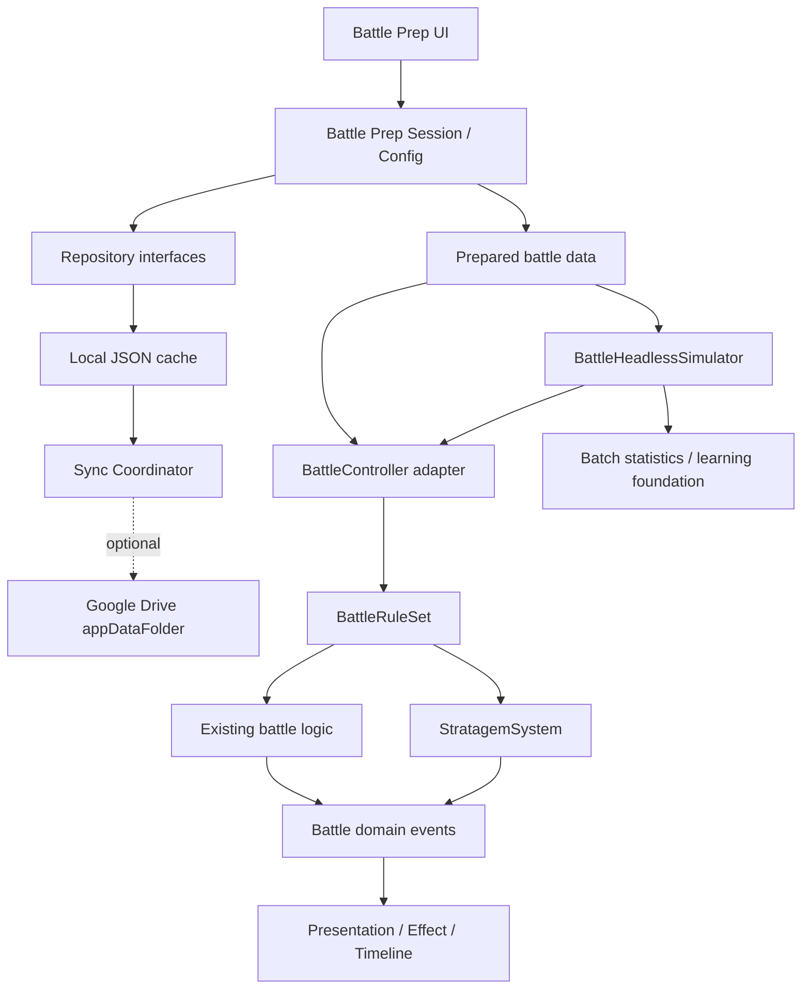
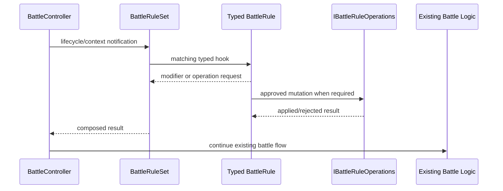
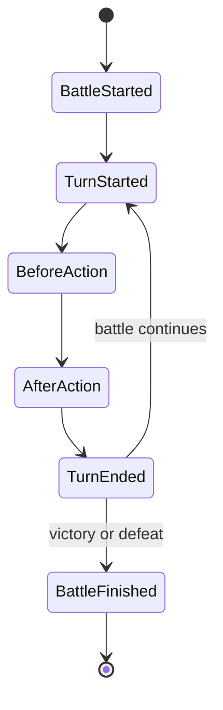
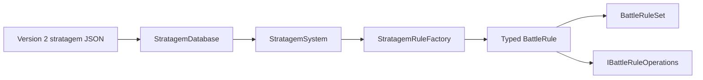
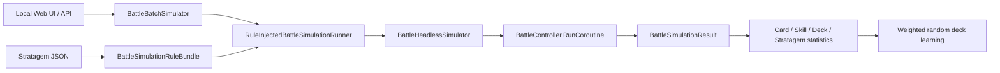
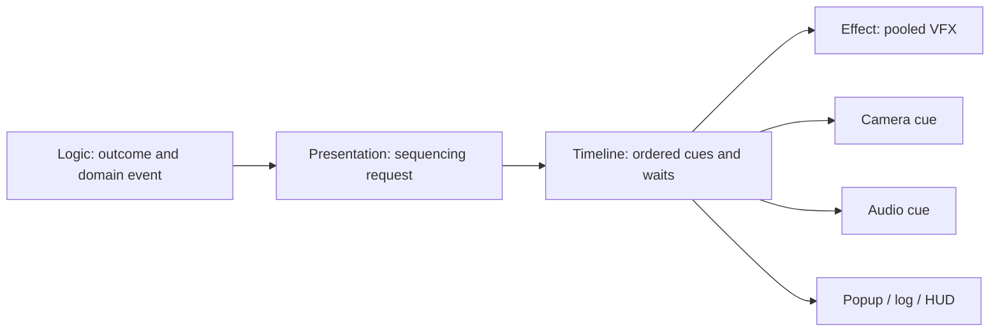
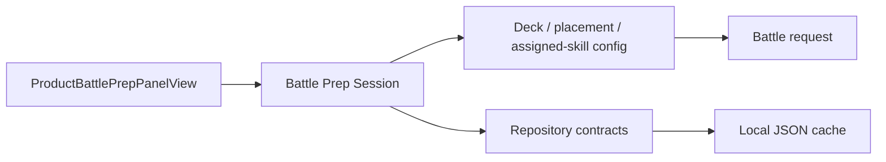
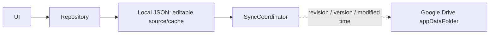

# Source of Thought — Historical Technical Architecture

> ARCHIVE / DEVELOPMENT HISTORY. The text below records the Unity-era architecture reviewed on 2026-08-08. It is not the specification or implementation status of the current public Web build. For the current introduction, use [Source of Thought](./index.html); the playable authority is [the public Web application](https://sot-web.onrender.com/). Historical details are retained, not silently adopted as current claims.

Source of Thought is a knowledge-driven card battle project built on ThoughtMap data. This page is the technical index for the current Unity implementation. It separates production-ready foundations from work that is still planned.

> Last reviewed: 2026-08-08  
> Scope: Battle, Battle Prep, simulation, effects, persistence, and the data-driven Thirty-Six Stratagems system.

## Documentation map

- [Project overview](./index.html)
- [Roadmap](./roadmap.html)
- [Changelog](./changelog.html)
- [Development articles](./devblog/index.html)
- [36 Stratagems Cognitive Bias Atlas](../stratagems/README.md)
- [Japanese project overview](./index-ja.html)

## Current architecture

The intended dependency direction is inward: views and storage adapters depend on application contracts; battle rules do not depend on Scene objects, UI, video, audio, or particles.

## Battle Rule Framework

### Core contracts

- `IBattleRule` is the marker contract for rule extensions.
- `BattleRuleSet` owns the ordered rule pipeline and returns identity/no-op behavior when no rule is registered.
- Typed contracts isolate each extension point, including lifecycle, target score, damage, resonance, SP generation, and action boundaries.
- `BattleRuleContext` is the immutable battle snapshot supplied to rules.
- `IBattleRuleOperations` is the explicit mutation boundary for effects that cannot be represented by a scalar modifier.
- `BattleRuleOperationsAdapter` maps approved rule operations to live battle units and status storage.

### Pipeline

`BattleController` remains a thin adapter around the rule pipeline. Target selection, damage, skill resolution, turn progression, and AI algorithms remain owned by the existing battle implementation. With an empty `BattleRuleSet`, behavior remains unchanged.

### Rule lifecycle

Lifecycle notifications provide timing; they do not transfer ownership of the battle loop to a rule.

## Stratagem System

The Thirty-Six Stratagems are a separate fixed-content domain. They are not Generated Skills and are not generated randomly at runtime.

### JSON-first architecture

JSON is the content source of truth. Runtime code maps `EffectType` to a typed rule but must not embed stratagem-specific balance values. Unknown or future effect types are skipped safely instead of aborting a battle.

### Version 2 data model

Each definition carries:

- stable ID, Japanese and English names, concept, description, and category;
- `EffectType` and `TargetType`;
- value, duration, cooldown, and SP cost;
- ten `AttributeWeights`: philosophy, psychology, science, economy, karma, emotion, morality, ideology, individual, and community;
- extensible parameters for effects that cannot be represented by one scalar value.

Representative `EffectType` values include `TargetScoreAdd`, `ThreatReduce`, `ResonanceMultiply`, and `SpTransfer`. The schema also reserves explicit operations such as revive, damage redirection, formation movement/locking, dispel, buff stealing, and status transfer. A reserved type is not considered implemented until a typed rule and tests exist.

`TargetType` describes intent independently of presentation: self, selected ally/enemy, teams, leader, lowest HP, and highest hate/threat are examples. Target resolution remains deterministic unless the battle rule explicitly defines otherwise.

### Attribute weights

Attribute weights are data, not ten independent hard-coded branches. They provide a future scaling input for effect magnitude, chance, duration, SP change, or resonance contribution. The selected scaling channel must be explicit per effect so one stratagem cannot accidentally multiply every dimension at once.

### Runtime status

- All 36 definitions have been migrated to Version 2 JSON.
- JSON parsing, legacy compatibility, and safe handling of unknown `EffectType` values are implemented.
- `StratagemRuleFactory` is the only effect-type-to-rule mapping point.
- Four representative rules have concrete battle behavior: `002`, `032`, `033`, and `035`.
- The remaining 32 definitions are content-complete but do **not** yet have complete runtime rules.
- The new Rule Operations and Rule Bundle foundations exist. Full production verification and completion of the remaining rules are still work in progress.

## Delivery phases

| Phase | Delivered outcome | Status |
|---|---|---|
| Phase 1 | Current-system analysis, boundaries, compatibility risks, and migration design | Complete |
| Phase 2 | `IBattleRule`, typed rule interfaces, `BattleRuleSet`, lifecycle, and UI-free `StratagemSystem` | Complete |
| Phase 3 | Minimal battle connection for `002`, `032`, `033`, and `035`; duration/cooldown/SP hooks | Complete |
| Phase 4 | Version 2 data model and centralized `StratagemRuleFactory`; values moved out of runtime constants | Complete |
| Phase 4.5 | All 36 stratagem records migrated to JSON; legacy loading retained | Complete |
| Phase 5 | `IBattleRuleOperations`, simulation Rule Bundle seam, and statistics extension foundation | Foundation complete |

“JSON complete” does not mean “36 runtime effects complete.” This distinction is intentional and should remain visible in future progress reports.

## Headless Simulator

The simulator does not copy battle logic. Its execution path is shared with the game:

Current foundations include:

- the same `BattleController` coroutine and `BattleRuleSet` used by the game;
- Version 2 stratagem JSON through a shared Rule Bundle provider;
- deterministic seeds, one-match and batch execution;
- card, skill, deck, and stratagem statistics models;
- generation-based weighted random selection with configurable exploration;
- extension seams for formation, resonance, pair statistics, genetic algorithms, and reinforcement-learning evaluators.

The simulator is an adapter and analysis surface. Simulator-only damage, AI, skill, target, or stratagem implementations are prohibited.

## Battle Effect Framework

- **Logic** determines targets, outcomes, damage, status, and victory. It does not animate.
- **Presentation** translates immutable battle events into visual requests.
- **Effect** owns reusable VFX instances, materials, particles, and effect-specific playback.
- **Timeline** coordinates timing without changing a calculated result.

Effect definitions are ScriptableObject-driven where appropriate, allowing VFX, camera, and audio work to change without editing battle calculations. Headless execution has no presentation consumers and therefore does not wait for UI, particles, video, or audio.

## Battle Prep responsibilities

- **View** binds controls, renders lists/details, and forwards user intent.
- **Session** coordinates selection, deck editing, placement, and skill assignment.
- **Config** is serializable state and remains compatible with the established JSON structure.
- **Repository** owns persistence access; the view must not read or write storage directly.

`ProductBattlePrepPanelView` remains larger than desired and is a current refactoring hotspot. New work should move orchestration into focused collaborators without changing UI, Prefabs, Scenes, or JSON.

## Persistence and synchronization

The intended save flow is:

Repository boundaries and local persistence are implemented foundations. Google Drive synchronization is designed as an optional remote synchronization adapter; local JSON remains available offline. Remote providers must be replaceable without making Battle Scene or UI aware of Google Drive, OneDrive, or Dropbox APIs.

## Current progress

### Implemented foundations

- Battle Rule Framework and typed rule pipeline
- Battle Effect Framework and timeline-oriented presentation separation
- Version 2 JSON assets for all 36 stratagems
- centralized Rule Factory and safe unknown-effect handling
- four representative runtime stratagem rules
- Headless and batch simulator sharing `BattleController`
- card-statistics learning foundation
- Repository-oriented persistence and local JSON cache
- Google Drive synchronization architecture and adapter boundaries

### Planned or incomplete

- concrete BattleRules for the remaining 32 stratagems
- complete production and simulator verification of the unified stratagem path
- Battle Director orchestration
- Hero Camera behavior
- Timeline and effect polish
- further `ProductBattleSceneView` responsibility extraction
- further `ProductBattlePrepPanelView` responsibility extraction
- retirement of Legacy Battle and old `StrategyDefinition` compatibility paths
- assembly-definition separation between domain, application, infrastructure, presentation, and editor tools
- automated architecture/dependency tests

## Technical debt

| Area | Current issue | Direction |
|---|---|---|
| `ProductBattleSceneView` | Composition, presentation coordination, HUD binding, and compatibility behavior remain concentrated | Extract composition/presenter services without moving battle logic into views |
| `ProductBattlePrepPanelView` | Large UI coordinator with historical responsibilities | Continue splitting by session, deck, formation, skill inventory, and binding responsibilities |
| Legacy Battle | Old MVP and compatibility paths coexist with production flow | Inventory references, migrate callers, then remove only after parity tests |
| Strategy compatibility | `StrategyDefinition` remains while Version 2 stratagem JSON becomes canonical | Keep read compatibility temporarily; prohibit new runtime dependencies |
| Assemblies | Runtime, presentation, infrastructure, and Editor dependencies are insufficiently isolated | Introduce asmdefs after dependencies are made explicit |
| Verification | Some integration claims rely on static inspection | Add deterministic PlayMode/EditMode parity tests and retained simulator fixtures |
| Documentation | Historical pages can describe superseded behavior | Treat this page and phase tables as the current status index; update links rather than creating duplicate DevLogs |

## Maintenance rules

1. Mark JSON assets, runtime rules, integration wiring, and Play Mode verification separately.
2. Do not describe a reserved `EffectType` as implemented.
3. Do not implement simulator-only battle behavior.
4. Keep presentation consumers optional and downstream from domain events.
5. Keep storage providers behind Repository contracts.
6. Update this index, the roadmap, and the changelog when a phase changes status.

